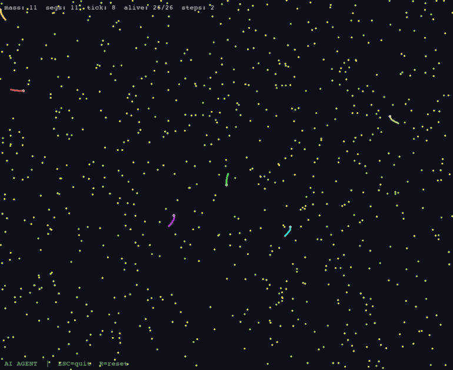

<p align="center">
  
  
  
  
  
</p>

# slither-gym

A high-performance, Gymnasium/PettingZoo-compatible reinforcement learning environment that faithfully recreates the mechanics of [Slither.io](http://slither.io) — continuous control, variable-length agents, partial observability, and emergent multi-agent dynamics.

<p align="center">
  
</p>

## Why slither-gym?

Most multi-agent RL environments are either too simple (grid worlds, particle envs) or too expensive (3D simulators). Slither.io sits in a sweet spot:

- **Continuous control** with rich spatial reasoning — not discrete grid movement
- **Variable agent count** — snakes die and respawn, so policies must handle a non-stationary world
- **Emergent strategy** — boosting to cut off opponents, sacrificing mass for kills, territorial control
- **Partial observability** — agents only see nearby food, enemies, and a density minimap
- **Pure Python + NumPy** — no C extensions, no GPU required, yet fast enough for serious training

| Feature | slither-gym | MPE | MAgent2 | Neural MMO |
|---|---|---|---|---|
| Continuous actions | **Yes** | Yes | No | No |
| Variable snake length | **Yes** | N/A | No | N/A |
| Partial observability | **Yes** | Optional | Yes | Yes |
| Pure Python | **Yes** | Yes | No | No |
| PettingZoo compatible | **Yes** | Yes | Yes | Yes |
| Gymnasium compatible | **Yes** | No | No | No |

## Quick Start

```bash
# Install
git clone https://github.com/segaul/slither-gym.git
cd slither-gym
uv sync

# Play it yourself
uv run python demo.py

# Run tests
uv run pytest tests/ -v

# Type check
uv run mypy src/slither_gym/ --strict
```

## Train Your First Agent (60 seconds)

```python
from stable_baselines3 import PPO
from slither_gym.rl.env_gym import SlitherGymEnv

env = SlitherGymEnv(num_bots=10, seed=42)
model = PPO("MultiInputPolicy", env, verbose=1)
model.learn(total_timesteps=100_000)

# Watch it play
obs, _ = env.reset()
for _ in range(1000):
    action, _ = model.predict(obs)
    obs, reward, done, truncated, info = env.step(action)
    if done or truncated:
        obs, _ = env.reset()
```

## Architecture

```
                          RL Interface
  ╔════════════════════════════════════════════════════════╗
  ║                                                        ║
  ║   env_gym.py      env_parallel.py      bot_policy.py   ║
  ║   (Gymnasium)     (PettingZoo)         (Rule-based)    ║
  ║        |                |                   |          ║
  ║        +--------+-------+-------------------+          ║
  ║                 |                                      ║
  ║    obs_processor.py          reward.py                 ║
  ║    - K-nearest food          - Mass delta              ║
  ║    - K-nearest enemy         - Kill bonus              ║
  ║    - Density minimap         - Edge penalty            ║
  ║                 |                                      ║
  ╚═════════════════|══════════════════════════════════════╝
                    |
                    v
                       Core Simulation
  ╔════════════════════════════════════════════════════════╗
  ║                                                        ║
  ║                      world.py                          ║
  ║            Orchestrates one physics tick               ║
  ║              /         |          \                    ║
  ║         snake.py    food.py    spatial_hash.py         ║
  ║         Movement    Spawn &    Grid-based O(1)         ║
  ║         & growth    collect    collision queries       ║
  ║                                                        ║
  ║         Pure game simulation — no RL dependencies      ║
  ╚════════════════════════════════════════════════════════╝
```

## Observation Space

Observations are a dictionary of NumPy arrays — designed for spatial reasoning:

| Key          | Shape          | Description |
|-------------|----------------|-------------|
| `self_state` | `(6,)`         | Normalized position, heading (cos/sin), log mass, speed |
| `food`       | `(32, 3)`      | K-nearest food pellets: relative x/y, value |
| `enemies`    | `(64, 7)`      | K-nearest enemy segments: relative x/y, is_head, log mass, speed, relative velocity angle, radius |
| `minimap`    | `(32, 32)`     | Circular density grid of snake mass across the full map |

## Action Space

Continuous `Box(3,)`: `[cos, sin, boost]`

- **cos, sin** — target heading direction (auto-normalized)
- **boost** — `> 0.5` activates boost: 2x speed, costs 5 segments/sec, floor at initial mass

## Reward Shaping

```
reward = mass_delta × 1.0        # grew by eating
       + remains_eaten × 1.0     # ate corpse food (from kills)
       + kill_count × 5.0        # killed another snake
       + 0.01                    # survival bonus per tick
       - 10.0 (if died)          # death penalty
       - edge_penalty            # progressive penalty past 80% map radius
```

## Game Mechanics

- **Movement**: Head advances at `speed`; body segments chain-follow with max gap = `segment_spacing`
- **Boost**: 2x speed, costs mass at 5 segments/sec, can't drop below initial mass
- **Collision**: Head hits another snake's body = death. Self-collision is ignored
- **Boundary**: Leaving the circular map = instant death
- **Death drops**: All segments become food pellets — bigger snakes drop richer food
- **Growth**: Eating food adds mass; segment count grows naturally as the tail extends
- **Turn rate**: Scales inversely with mass — big snakes are powerful but sluggish

## Demo Controls

| Key     | Action             |
|---------|--------------------|
| Mouse   | Steer snake        |
| Space   | Boost (costs mass) |
| R       | Reset              |
| Esc / Q | Quit               |

## Configuration

Both the simulation and observation pipeline are fully configurable:

```python
from slither_gym.core.types import WorldConfig
from slither_gym.rl.types import ObsConfig

config = WorldConfig(
    map_radius=3000.0,       # circular arena size
    max_snakes=32,           # max concurrent snakes
    base_speed=3.0,          # normal movement speed
    boost_speed=6.0,         # boosted speed
    segment_spacing=5.0,     # gap between body segments
    step_mul=4,              # physics ticks per env.step()
    perception_radius=500.0, # how far agents can see
    max_food=16384,          # food pool capacity
)

obs_config = ObsConfig(
    k_food=32,               # food pellets in observation
    k_enemies=64,            # enemy segments in observation
    minimap_size=32,         # minimap grid resolution
)
```

## Performance

Pure Python + NumPy with spatial hashing for O(1) collision queries. No compiled extensions needed.

```
$ uv run pytest tests/test_performance.py -v
test_throughput PASSED   # >300 steps/sec with 10 bots (single core)
```

## Roadmap

- [ ] Self-play training pipeline (PBT / league training)
- [ ] Curriculum learning — progressive difficulty scaling
- [ ] Human vs. trained agent mode
- [ ] Replay recording and playback
- [ ] WebSocket bridge for browser-based visualization
- [ ] PyPI package release

## Package Structure

```
slither_gym/
├── core/                  # Pure simulation — zero RL dependencies
│   ├── types.py           # WorldConfig, SnakeState, StepResult
│   ├── snake.py           # SnakeManager — movement, growth, death
│   ├── food.py            # FoodManager — spawn, collect, free-list
│   ├── spatial_hash.py    # Grid-based spatial index for collision
│   ├── minimap.py         # Circular minimap density grid
│   └── world.py           # World — orchestrates one physics tick
└── rl/                    # RL interface layer
    ├── types.py           # ObsConfig, RawGameState, AgentId
    ├── obs_processor.py   # K-nearest observation computation
    ├── reward.py          # Reward shaping (pure function)
    ├── bot_policy.py      # Rule-based bot (flee > eat > wander)
    ├── env_parallel.py    # PettingZoo ParallelEnv
    └── env_gym.py         # Gymnasium single-agent wrapper
```

## Contributing

PRs welcome. If you train an interesting agent or find a bug, open an issue.

```bash
uv run pytest tests/ -v          # all tests must pass
uv run mypy src/slither_gym/ --strict  # strict type checking
```

## Citation

```bibtex
@software{slither_gym,
  title  = {slither-gym: A Multi-Agent RL Environment for Slither.io},
  author = {segaul},
  url    = {https://github.com/segaul/slither-gym},
  year   = {2026}
}
```

## License

MIT
